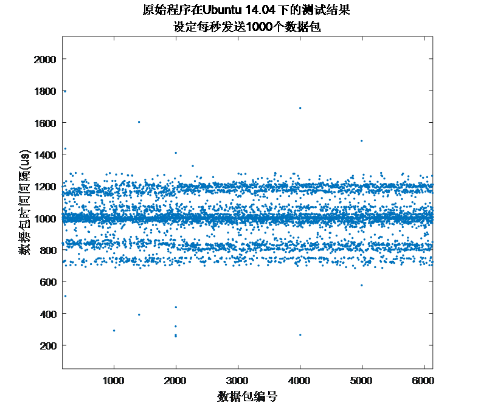
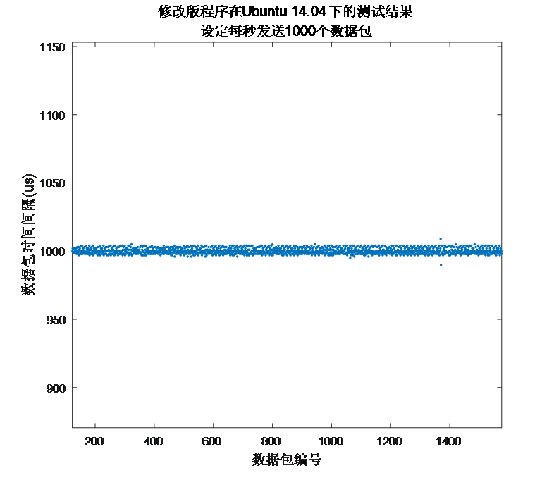

#  Linux 802.11n CSI Tool监控模式下高速等间隔发包

# 使用
此代码基于Linux 802.11n CSI Tool,请确保你已经安装并可以正常使用 
https://github.com/dhalperi/linux-80211n-csitool.

此代码运行在Linux 802.11n CSI Tool的监控模式下，下载此代码并替换到 linux-80211n-csitool-supplementary/injection 文件夹下.

 然后在 linux-80211n-csitool-supplementary/injection 文件夹下运行以下命令:
~~~
make
sudo ./random_packets 1000 100 1 1000
~~~

# 测试结果

